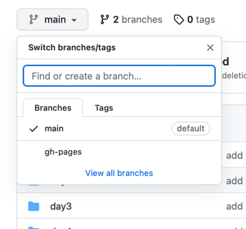
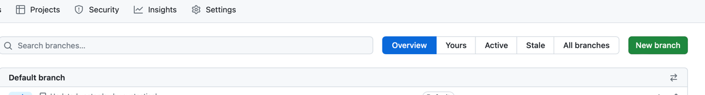
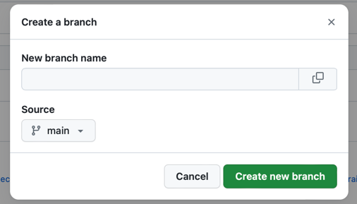
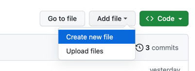

# Setup GitHub Webpage
1. Create a repo or use an existing one.
1. Create a new branch named `gh-pages`. 
   2. Click the branch dropdown, then click `View all branches` 
      
   3. Click the green `New Branch` button.
      
   4. Give your new branch a name.
      
1. Create a index.html file in your new branch and commit.
   
2. Your webpage should now be availabe at https://GITHUB_USERNAME.github.io/REPOSITORY_NAME/