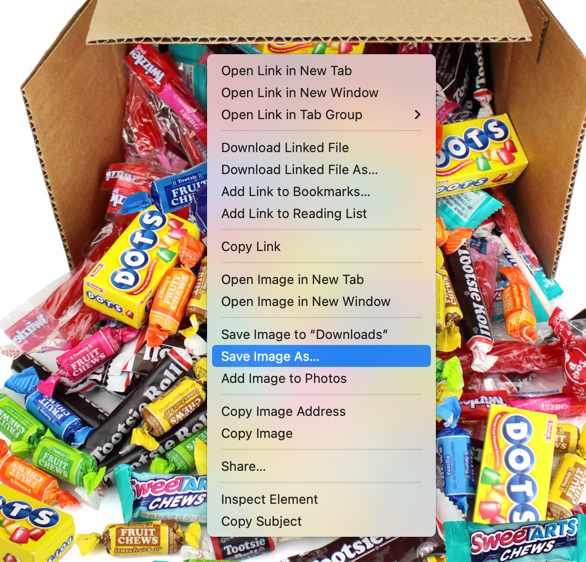
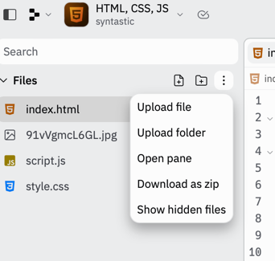

# Concepts

## Images
To get images for our site, open your favorite search engine (like google.com) and search for a 
topic of your choice.  Once you've found an image you like, right click the image and save it.


Now we need to upload the image in Replit.  Click the three vertical dots in the upper right hand corner and select `Upload file`  
  

Now we can add the image to our site using the file name, the example below uses the name for the file I downloaded and will be different for you. 
Add the following to your `index.html` file.

```html

```

## Adjusting image size with CSS
If your image is too large or too small we can change its size using CSS. For my image, 
it's too large, so I will shrink it down to 20% of its original size.

```css
.candy {
  height: 20%;
  width: 20%;
}
```

Here `candy` is a class and can be applied to any html element by adding the `class` attribute.

example
```html

```

We could have also styled the `img` but it would have applied to all images on our site and not just this one.

example 
```css
img {
  height: 20%;
  width: 20%;
}
```

