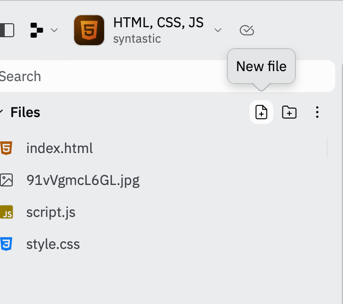
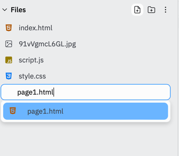

# Concepts

## (Hyper)Links
Links can be used to direct people to new pages are parts of existing pages.  Links use the 
anchor tag and specify the location with the `href` attribute.

```html
<a href="https://www.google.com">click to go to Google</a>
<a href="waffle.html">click here to go to the best breakfast food</a>
<a href="pancakes.html">click here to go to a less great breakfast food</a>
```

You can also use links to jump to a section of a long page by using the section elements 'id'
```html
<a href="#waffles">jump to the best section of this page</a>
... millions of lines of text and html 
<div id="waffles">
    <h1>Waffles are the king of breakfast foods!</h1>
</div>
```
## Creating additional pages
Now that we know about links we can create new pages to link to.  To create a new page click the 
new file icon in the upper right of the replit page.  


Give the new file a name that ends with `.html`  


Now add the following to get the page started.
```html
<!DOCTYPE html>
<html>

<head>
  <meta charset="utf-8">
  <meta name="viewport" content="width=device-width">
  <title>replit</title>
  <link href="style.css" rel="stylesheet" type="text/css" />
</head>

<body>
    Put your page contents here
</body>
</html>
```

We can now add a link from our main page to our new page.
```html
<a href="page1.html">Check out my new page</a>
```

## Using Javascript to alter the page
You can use Javascript to interact with the webpage.  When using Javascript in a webpage, there 
is a special variable available called `document`.  We can use the `document` variable to interact
with the page by dynamically by referencing elements like `document.body` to get the body tag, 
searching for an element by id `document.getElementById('element-id')`, etc.

example: check the background of the body tag to a random color
```javascript
// The code below generates a random number between 0 and 16777215 and then converts it
// to hexadecimal, which is used to represent colors, then assigns it to the body tags 
// background-color css attritbute.
document.body.style.backgroundColor = "#" + Math.floor(Math.random()*16777215).toString(16);
```

We can assign this functionality to a button by using the buttons `onclick` attribute.
```javascript
function changeColor() {
  document.body.style.backgroundColor = "#" + Math.floor(Math.random() * 16777215).toString(16);
}
```
```html
<input type="button" onclick="changeColor()" value="click me" >
```

And if we want to hurt your users eyes, we can use the `setInterval` function to call our
`changeColor` function at a timed interval
```javascript
function changeColor() {
  document.body.style.backgroundColor = "#" + Math.floor(Math.random() * 16777215).toString(16);
}
setInterval(changeColor, 200) // calls changeColor every 200 milliseconds (5 times a second)
```

We can use Javascript to even change the contents of our page.
```html
<div id="section1"></div>
<input type="button" onclick="changeColor()" value="click me">
```
```javascript
function addText() {
  document.getElementById("section1").innerHTML = "This is new <b>text</b>"
}
```